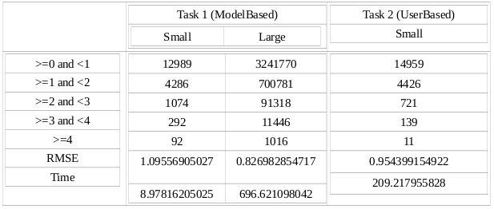

## Jaccard Distance and Collaborative Filtering

### Execution Syntax with output files
- spark-submit Vishal_Seshagiri_task1_Jaccard.py <ratings_file> - Vishal_Seshagiri_SimilarMovies_Jaccard.txt
- spark-submit Vishal_Seshagiri_task2_UserBasedCF.py <ratings_file> <testing_file>
- Vishal_Seshagiri_UserBasedCF.txt
- spark-submit Vishal_Seshagiri_task2_ModelBasedCF.py <ratings_file> <testing_file>
- This section has 2 outputs one for small and one for big
	- Vishal_Seshagiri_ModelBasedCF_Small.txt
	- Vishal_Seshagiri_ModelBasedCF_Big.txt

#### Jaccard (LSH)
-	Precision = 1.0
-	Recall = 0.999786587826
-	Time taken = 199.905250072

#### Spark Version => 2. 2. 1
#### Python Version => 2.7.12